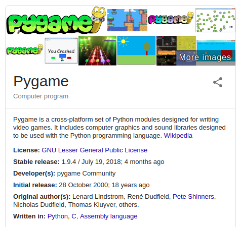
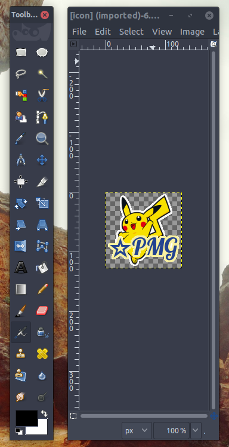
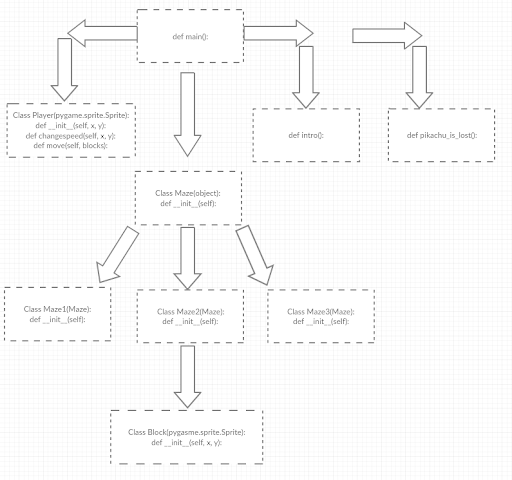
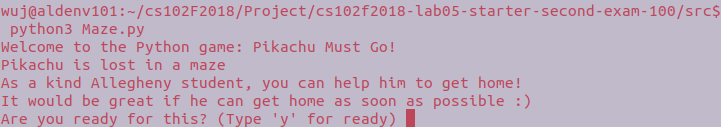
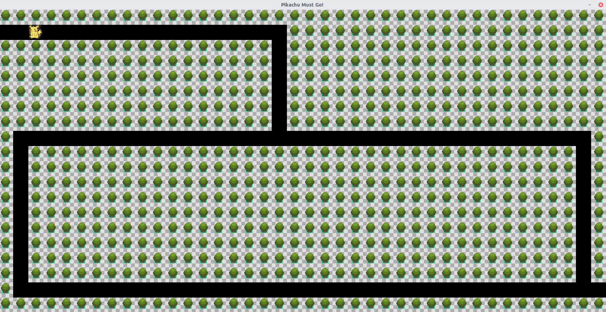
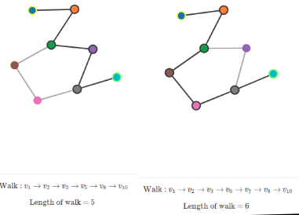
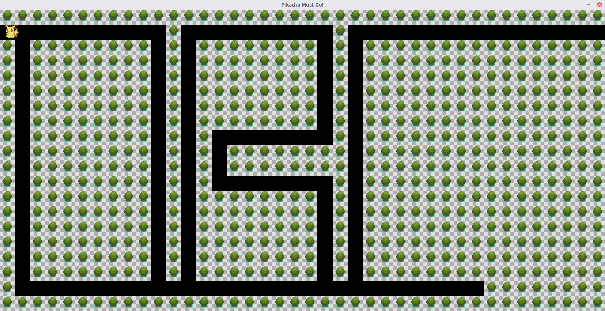
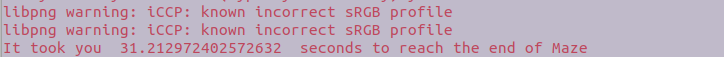

## Date: 9 Dec 2018
## Group Names: Lancaster Wu, Devin Ho, Jon Reibel, Devin Spitalny

## Paragraph 1: Motivation
The motivation of this project was developed on the idea of the seven bridges of Konigsberg. The seven bridges problem was based in Konigsberg, Prussia, which included a mathematical problem where the city was separated by the Pregel River and two large islands called Kneiphof and Lomse. The goal was to connect bridges across the river and to the islands once and only once. This solution would make the city more transparent meaning they would be able to go to one location as quick as possible. The seven bridges of Konigsberg help set up the concept of graph theory. Graph Theory is the mathematical theory of the properties and applications of graphs. We wanted to use graph theory and implement that into a maze game. The reason we picked creating a maze game was from our very own Lancaster Wu. It all started when we were playing a regular maze game online and he summoned us to a competition. The competition consisted of all of us playing the same level of the maze game we found online and whoever finished in the fastest time wins. That's where we figured out we can implement the idea of graph theory in the maze. The idea of our project is to use graph theory in our maze to find the quickest path from start to finish.

We created a maze game that included a graphical interface. This game starts off in the terminal where the story begins. The narrator of the story asks you to help Pikachu to guide him through the maze. The user is then prompted to input “y” to begin the game. A window appears as the game, and then the user plays as Pikachu. We implemented this by creating different classes and functions for the the terminal output as well as the graphic interface. We trigger the graphical interface and then utilize the Pygame module to add background music, icons, and images. There are separate classes for the 3 different mazes as well as the player and blocks for collision. After the player reaches the end of the maze, the game will end and the graphical interface will close. The terminal will then output a timer noting how long it took the player to reach the end of the maze to win the game. This gives us a good understanding of how graph theory is used by manually running the maze yourself. You can take different paths in order to reach the end and see how long it took for each path.

Provided here is a flow chart designed to show how the code interacts with itself. It links the classes and definitions showing how each piece is called and linked back to other classes and definitions.

So as you can see, This diagram is made up of several classes and definitions. Each one preforms a specific task that differs from the others.It may seem difficult to sort out all of the task being preformed within the code but using our knowledge from class it is rather simple. Since the code is based on a few classes and definitions, it was actually rather simple to see how it is all interconnected. For example, The Maze class instantiates an instance of the maze and then allows it to be called by the Maze1, Maze2, and Maze3 classes. That was just one example, you can see how other links are created by further studying the provided diagram. Knowing how the code worked was a key step in this process as it allowed us to spend more time focusing on the implementation and functionality of our project rather than trying to decipher the code.

The program will provide an output of print lines asking user to choose if they are ready or not. User needs to type “y” (lower case) to start run the maze game.

If the user type anything besides “y”(lower case), the program will end.

If the user does type “y”(lower case) to run the program, the maze game will run. The user can control the character which is a Pikachu by using “up”, “down”, “left”, and “right”.  The music, “ Pikachu theme song”, will be running while user playing the game. The following picture is the first maze:

Two possible walks of the first maze:

The second maze:

The third maze:

After user finished the third maze, they will be able to see the time cost of running the maze.

Based on the different path choices made by users, even if they are moving the character with the exactly same speed, the result time cost will be different.

Our team originally came up with the maze idea and discussed the different attributes the game would have to include. After we planned out our ideas, we ran into some issues. We did some research and decided to use Pygame for the base of our game. It included the methods that we needed to create the game and also create the add-ons. In this case, Lancaster created most of the classes responsible for the actual structure of the maze, including: Player, Block, Maze1, Maze2, and Maze3. Jon was working on figuring out how to make the block have collision. This sets the bound for the player to inhibit him from moving through a block. Devin Ho worked on the user interface along with the graphical side of the game. He used Pygame methods in order to initialize and load the images for the window icon, taskbar icon, and background music for the game. Devin Spitalny worked on fixing the issues in the program when the Python compiler failed and could not run the program. He was in charge of creating the presentation for our group. All in all, our group ran into many setbacks, but we were able to solve the problems and implement the game in a sufficient time-frame.

                                    Works Cited
Resources:

Pandey, Avinash. “Interactive Graph Theory Tutorials.” D3 Graph Theory, mrpandey.github.io/d3graphTheory/unit.html.

“Python Advanced Course Topics.” Python Advanced: Introduction into the Sys Module, www.python-course.eu/graphs_python.php.

m8gr75. “m8gr75/Pygame.” GitHub, github.com/m8gr75/pygame/blob/master/Maze_1.py.

Media:

http://thestudents.wikia.com/wiki/File:Pikachu_transparent.png

https://i.pinimg.com/originals/c3/47/91/c34791950b712e3c50b9d87b3b03f510.png

https://www.youtube.com/watch?v=BBZVGDoGDlo
