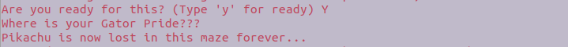

## Date: 9 Dec 2018
## Group Names: Lancaster Wu, Devin Ho, Jon Reibel, Devin Spitalny

## Paragraph 1: Motivation

## Paragraph 2: Detailed description of completed work. What you implemented and how

We created a maze game that included a graphical interface. This game starts off in the terminal where the story begins. The narrator of the story asks you to help Pikachu to guide him through the maze. The user is then prompted to input “y” to begin the game. A window appears as the game, and then the user plays as Pikachu. We implemented this by creating different classes and functions for the the terminal output as well as the graphic interface. We trigger the graphical interface and then utilize the Pygame module to add background music, icons, and images. There are separate classes for the 3 different mazes as well as the player and blocks for collision. After the player reaches the end of the maze, the game will end and the graphical interface will close. The terminal will then output a timer noting how long it took the player to reach the end of the maze to win the game. This gives us a good understanding of how graph theory is used by manually running the maze yourself. You can take different paths in order to reach the end and see how long it took for each path.

## Paragraph 3: UML Diagram

## Paragraph 4: Description of results. Graphs tables snapshots to provide understanding.
The program will provide an output of print lines asking user to choose if they are ready or not. User needs to type “y” (lower case) to start run the maze game.

If the user type anything besides “y”(lower case), the program will end.

If the user does type “y”(lower case) to run the program, the maze game will run. The user can control the character which is a Pikachu by using “up”, “down”, “left”, and “right”.  The music, “ Pikachu theme song”, will be running while user playing the game. The following picture is the first maze:

Two possible walks of the first maze:

The second maze:

The third maze:

After user finished the third maze, they will be able to see the time cost of running the maze.

Based on the different path choices made by users, even if they are moving the character with the exactly same speed, the result time cost will be different.

## Paragraph 5: Conclusion. Short recap and results. What was learned. Challenges and rewards.(devin spitany)

## Paragraph 6: Team member contributions

Our team originally came up with the maze idea and discussed the different attributes the game would have to include. After we planned out our ideas, we ran into some issues. We did some research and decided to use Pygame for the base of our game. It included the methods that we needed to create the game and also create the add-ons. In this case, Lancaster created most of the classes responsible for the actual structure of the maze, including: Player, Block, Maze1, Maze2, and Maze3. Jon was working on figuring out how to make the block have collision. This sets the bound for the player to inhibit him from moving through a block. Devin Ho worked on the user interface along with the graphical side of the game. He used Pygame methods in order to initialize and load the images for the window icon, taskbar icon, and background music for the game. Devin Spitalny worked on fixing the issues in the program when the Python compiler failed and could not run the program. He was in charge of creating the presentation for our group. All in all, our group ran into many setbacks, but we were able to solve the problems and implement the game in a sufficient time-frame.

## Include all sources for important websites and images used and make a short bibliography.

https://mrpandey.github.io/d3graphTheory/unit.html
https://www.youtube.com/watch?v=BBZVGDoGDlo
